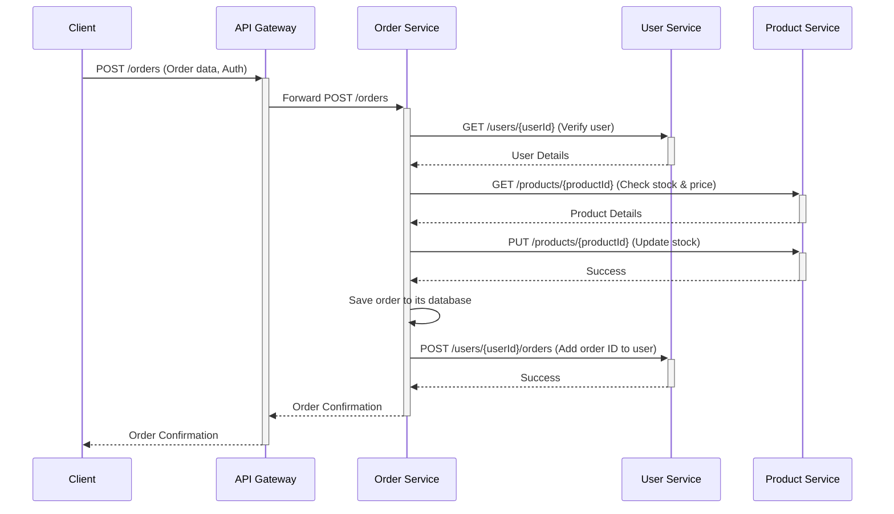

# 🛍️ E-commerce Microservice Platform

This project is a fully functional e-commerce platform built using a microservices architecture with **Java 21**, **Spring Boot 3**, and **Spring Cloud**. It demonstrates how to build a distributed system where different services handle distinct business capabilities, such as managing users, products, and orders.

## ✨ Features

- **Service Discovery:** Services register with a Eureka server, allowing for dynamic and resilient inter-service communication.
- **Centralized Entry Point:** A single API Gateway routes all external traffic to the appropriate microservice.
- **Role-Based Security:** Endpoints are secured using Spring Security with distinct roles for `ADMIN` and `CUSTOMER`.
- **Product Management:** Full CRUD operations for products, plus filtering by name, category, and price range.
- **User Management:** Full CRUD operations for users.
- **Order Processing:** A complete workflow for placing orders, which validates user existence and updates product inventory in real-time.
- **API Documentation:** Each service exposes its API documentation using Swagger (OpenAPI 3).

---

## 🏗️ Architecture

This platform is composed of five core microservices that work together. Communication between services is handled via REST APIs using OpenFeign, which integrates seamlessly with Eureka for service discovery.


1.  **`discovery-service` (Eureka Server)**
    - The central registry where all other services register themselves. It acts as the "phone book" for the entire system.

2.  **`api-gateway` (Spring Cloud Gateway)**
    - The single entry point for all client requests. It handles:
    - **Routing:** Directs incoming requests to the correct microservice.
    - **Security:** Enforces authentication and authorization for all endpoints.
    - **Cross-Cutting Concerns:** Provides a fallback mechanism for when services are unavailable.

3.  **`user-service`**
    - Manages all user-related data, including user profiles and their order history.

4.  **`product-service`**
    - Manages the product catalog, inventory, pricing, and categories.

5.  **`order-service`**
    - Orchestrates the order placement process by communicating with the `user-service` and `product-service` to validate data and update state.

### Communication Flow Example: Placing an Order

Here's how the services interact when a customer places an order:



---

## 🛠️ Technology Stack

- **Frameworks:** Spring Boot 3.3.0, Spring Cloud 2023.0.1
- **Language:** Java 21
- **Service Discovery:** Spring Cloud Netflix Eureka
- **API Gateway:** Spring Cloud Gateway
- **Inter-service Communication:** OpenFeign (Declarative REST Client)
- **Data Persistence:** Spring Data JPA / Hibernate
- **Database:** H2 In-Memory Database
- **Security:** Spring Security (Basic Authentication)
- **API Documentation:** SpringDoc OpenAPI (Swagger 3)
- **Build Tool:** Gradle

---

## 🚀 Getting Started

Follow these steps to get the application up and running on your local machine.

### Prerequisites

- [JDK 21](https://www.oracle.com/java/technologies/downloads/#java21)
- [Gradle](https://gradle.org/install/) 8.x or higher

### Running the Application

The services must be started in a specific order to ensure they can register and communicate correctly. Open a separate terminal for each service.

**1. Start the Discovery Service**
```bash
cd discovery-service
./gradlew bootRun
```
Wait until the Eureka server is running. You can check its status at `http://localhost:8761`.

**2. Start the Core Microservices**
Start the `user-service`, `product-service`, and `order-service`. The order among these three does not matter.

```bash
# In a new terminal
cd user-service
./gradlew bootRun
```
```bash
# In a new terminal
cd product-service
./gradlew bootRun
```
```bash
# In a new terminal
cd order-service
./gradlew bootRun
```
Check the Eureka dashboard (`http://localhost:8761`) to confirm that all three services have registered successfully.

**3. Start the API Gateway**
This is the final step. The gateway will act as the entry point for all your requests.
```bash
# In a new terminal
cd api-gateway
./gradlew bootRun
```
The entire platform is now running! The API Gateway is accessible at `http://localhost:8080`.

---

## 🔐 Security Configuration

The API endpoints are secured using **HTTP Basic Authentication**. Use the following credentials to access the protected routes.

-   **Admin Role:**
    -   **Username:** `admin`
    -   **Password:** `adminpass`
-   **Customer Role:**
    -   **Username:** `customer`
    -   **Password:** `custpass`

**Role Access:**
-   **ADMIN:** Can access all endpoints, including product creation/deletion and user management.
-   **CUSTOMER:** Can view products and place/view their own orders.

---

## 📖 API Documentation (Swagger)

Each microservice has its own Swagger UI for exploring and testing the API endpoints. You can access them through the API Gateway's routes.

-   **User Service:** `http://localhost:8080/user-service/swagger-ui.html`
-   **Product Service:** `http://localhost:8080/product-service/swagger-ui.html`
-   **Order Service:** `http://localhost:8080/order-service/swagger-ui.html`

When prompted for credentials by Swagger, use the usernames and passwords listed in the **Security** section above.
